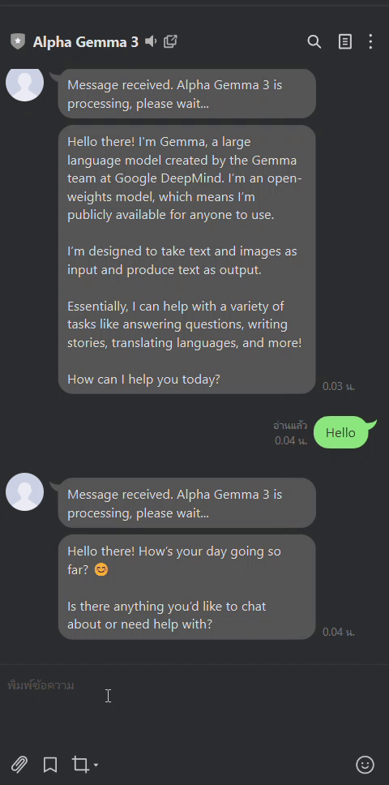

# Line AI Chat Bot
This is a mini workshop for building a simple LINE chat bot using Ollama, which I have adapted to work with the LINE Messaging API.

**Stack**: Hono, LINE Messaging API, Ollama, Open WebUI, Gemma3:1b

## Preview
<div align="left">
   
</div><br>


# Installation and Setup

## Set up Environment Variables

1. Create a `.env` file or set up these environment variables:
    - `PORT`: App server port.
    - `OPEN_WEB_UI_URL_BASE`:
    - `OPEN_WEB_UI_API_KEY`:
    - `LINE_ACCESS_KEY`:

## Set Up Ollama and Open WebUI

1. Run `docker network create -d overlay --attachable line_net` to create a Docker network.
2. Start Ollama and Open WebUI with:
    ```sh
    docker compose -f docker-compose-service.yaml up -d --build
    ```
3. Connect to the Ollama container using bash or any shell:
    - Run `ollama pull <model>` for the model you want (I used `gemma3:b1`).
    - Run `ollama list` to check your models.
4. Go to Open WebUI at [http://localhost:8080](http://localhost:8080):
    - Register and log in.
    - Go to Settings > Admin Settings > Connection. In the "Manage Ollama API Connections" section, add your Ollama container (the one you pulled the model to) to connect with Ollama. For example, use `ollama:11434` (I used the service name instead of the URL because of the overlay network).
    - Go to Settings > Account to find "Change Password" and your API Key. Now you have your API Key!
5. Set up the LINE webhook in the Messaging API with the path `/api/v1/line/webhook`.

## Run App Server (Docker)

1. Run `docker-compose up -d --build` to start the app server.
2. Set `OPEN_WEB_UI_URL_BASE` to your Docker DNS with the `http://` prefix. For example: `http://open-webui:8080`
3. Now you can chat with your bot!

## Run in Development Mode

1. Run `npm install` to install dependencies.
2. Run `npm run dev` to start the server.
    - You don't need to set `OPEN_WEB_UI_URL_BASE` unless you want to connect to your own running Open WebUI.
3. Call `GET /` to check if the server is healthy.
4. The LINE webhook must be HTTPS and not localhost. I used ngrok for testing.

# Reference

- Ollama Model: https://ollama.com/library/gemma3
- Open WebUI Docs: https://docs.openwebui.com/getting-started/api-endpoints/
- LINE Messaging API Docs: https://developers.line.biz/en/reference/messaging-api/
